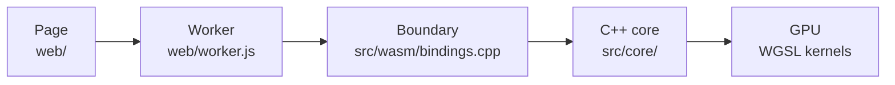

<p align="center">
  
</p>

# Charlotte

**Try it: <https://plainsight-systems.github.io/charlotte/>**

Charlotte is an inference harness I wrote that runs open-weight language
models entirely in your browser. It's C++ compiled to WebAssembly, and every
step of the model runs on the GPU through WebGPU. Nothing runs on a server.
The page downloads a model from Hugging Face once, caches it on your device,
and everything after that happens locally.

It runs Qwen3 0.6B, Llama 3.2 1B Instruct and Gemma 3 1B. You can also paste
a link to any GGUF file, and the page reads only the file's header to tell
you whether this build can run it and how much context fits on your device.

## Why I built it

Charlotte is a tech demo on purpose: a real harness, built to full quality on
a deliberately narrow slice. I've built inference harnesses before; this one
is for seeing the model from another angle. What do attention, quantized
weights and the KV cache look like when WebGPU gives you no f32 matrix units,
16 KiB of workgroup memory and a single-threaded WebAssembly module? Each
limit forces a decision a server engine never has to make, and those
decisions keep turning up things I hadn't seen, like the same token's
projections coming out as different bits in decode and prefill because each
WGSL pipeline was free to fuse a multiply-add its own way.

The name is a nod to *Charlotte's Web*: a spider who lives in a web and writes
words into it.

Charlotte is R&D under Plainsight Systems LLC. The site is a static build
hosted on GitHub Pages, deployed from `main` on every push.

**Browsers:** Chrome and Edge on desktop. Safari's WebGPU is WebKit's own
implementation rather than Dawn, so it is a separate verification problem and
is not assumed to work.

## Run it locally

You need `make`, Python 3 and Docker. The WebAssembly build runs inside the
pinned `emscripten/emsdk:6.0.8` image, so you do not install a toolchain, and
your build matches CI's.

```sh
git clone https://github.com/plainsight-systems/charlotte.git
cd charlotte
make serve
```

Then open <http://localhost:8080> in Chrome or Edge. The first build pulls the
toolchain image. The page has to be served over http(s): it cannot run from
`file://`, where module loading and the model fetch both fail.

Two more sites are built for development and never deployed:

| Command | Port | What it adds |
|---|---|---|
| `make serve-dev` | 8081 | `?benchmark`: time to first token and decode rate, once a model loads |
| `make serve-diag` | 8082 | `?profile`: each turn's GPU time, step by step. Diagnostic, so its numbers are not throughput |

### Tests

The unit tests build natively and need CMake 3.25 or later, a C++20 compiler
and Node.js. They include GPU tests that run the real kernels on your
machine's GPU through native Dawn, which is prebuilt for macOS on Apple
silicon and for Linux x86-64.

```sh
make test     # C++ and GPU tests, then the JavaScript tests
make check    # structural rules, and tests proving each check fires
```

The first `make test` fetches about 1.9 GB of test data (the three models
and Unicode's normalization tests) and native Dawn, each verified against a
pinned SHA-256, into `.cache/`.

## Find your way around

A turn starts in the page and ends on the GPU, and the repository is laid out
along that path:



- **The page, `web/`,** is plain JavaScript modules with no build step. It
  picks a model, downloads and verifies it into the browser's private
  storage, renders the chat template and streams the reply.
- **The worker, `web/worker.js`,** owns the WebAssembly module, so the model
  runs off the page's main thread.
- **The boundary, `src/wasm/bindings.cpp`,** is the only C++ that knows it is
  in a browser. Nothing else crosses between JavaScript and C++.
- **The core, `src/core/`,** is everything from reading the model file to
  drawing the next token, and builds and tests natively.

  | Directory | What it does |
  |---|---|
  | `gguf/` | reads the model file, treating it as untrusted |
  | `preflight/`, `capability/` | decides, from the header, how far this build can take a model |
  | `arch/`, `model/`, `graph/` | turns each architecture into one model description and its graph |
  | `residency/` | plans the GPU memory and uploads the weights still quantized |
  | `formats/`, `quant/` | each weight format's layout in the file and on the GPU, and its unpacking in WGSL |
  | `kernels/` | the WGSL kernels and the program that runs them, one compute pass a step |
  | `tokenizer/` | byte-level and SentencePiece BPE |
  | `cache/` | the KV cache, and the prompt prefix a turn can reuse |
  | `sampler/`, `runtime/` | drawing a token on the GPU, and the turn loop around it |
  | `gpu/` | the WebGPU device and its handles |

Everything else:

| Path | What it holds |
|---|---|
| `tests/` | unit and GPU tests; `tests/gpu/reference_test.cpp` checks each model's output against llama.cpp |
| `bench/` | native benchmarks: the tokenizer, and the forward pass's GPU time launch by launch |
| `tools/` | site assembly, fixture generators, and the structural checks |
| `docs/architecture/` | the design |
| `docs/research/` | measurements and investigations, each dated, with its method and conditions |
| `docs/process/` | decisions and the work queue |

### Reading the design

Read these in order:

1. [`logical-overview.md`](docs/architecture/logical-overview.md): what the
   harness does, the four points where it varies by model family, why the KV
   cache is family-agnostic, and the platform constraints that shape all of
   it.
2. [`change-axes.md`](docs/architecture/change-axes.md): the reasons any file
   here changes, and the rule that decides where code goes: one translation
   unit, one reason to change.
3. [`file-mapping.md`](docs/architecture/file-mapping.md): which files
   implement each part, and the contracts between them.
4. [`kernel-fusions.md`](docs/architecture/kernel-fusions.md): which steps
   share a GPU dispatch, and why a dispatch's cost in the browser makes that a
   design decision.

Then the code: each file's header states its contract and its design.

## License

Code is licensed under the Apache License 2.0; documentation, prose and
original visual assets under CC BY 4.0. See [`LICENSE`](LICENSE) for the
split, and [`NOTICE`](NOTICE) for third-party components and their licenses.
