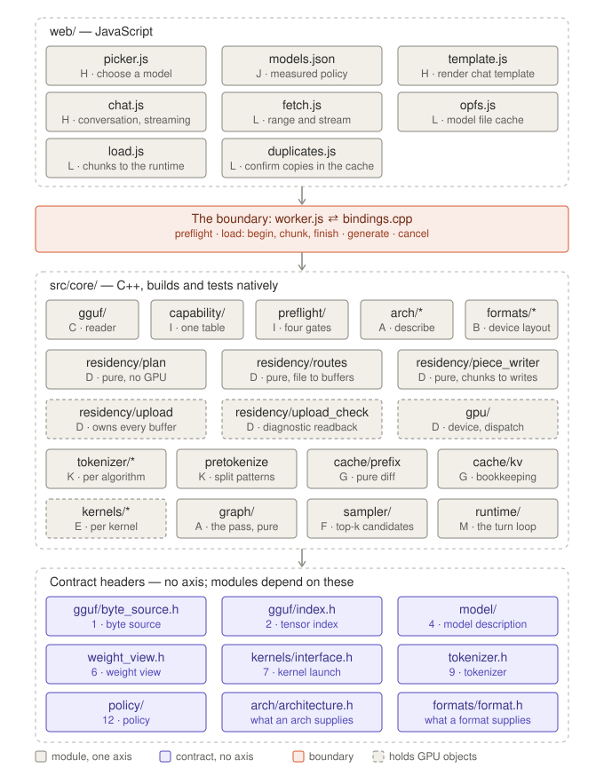
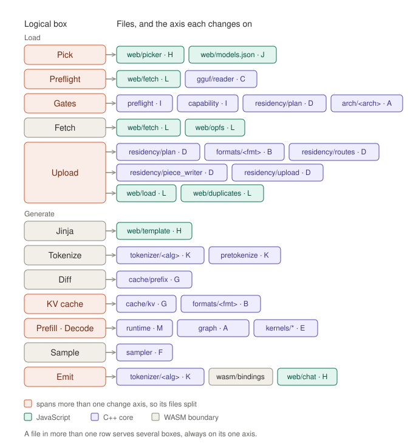

# File mapping

How the boxes in [`logical-overview.md`](logical-overview.md) become files,
applying the rule in [`change-axes.md`](change-axes.md): one translation unit,
one reason to change.

It names the modules, the axis each changes on, and the contracts between
them.

## Layers

- **JavaScript, `web/`** — the interface, the curated model list, template
  rendering, network and storage.
- **The boundary** — `web/worker.js` on the JavaScript side and
  `src/wasm/bindings.cpp` on the C++ side. Nothing else crosses.
- **C++ core, `src/core/`** — everything from the file header onward. Never
  aware it is in a browser; builds and tests natively.

Dependencies point downward only: JavaScript to the boundary, the boundary to
the C++ modules, the modules to the contract headers. Nothing in `src/core/`
includes from `web/` or `src/wasm/`, and `tools/check_boundaries.sh` enforces
it. A directory marked `*` holds one subdirectory per implementation, each
listed in the capability table. Contracts 3, 5, 8 and 10 are stated in their
module's own header, and contract 11 in the two boundary files.

## Modules

| Module | Axis | Owns |
|---|---|---|
| `web/app.js` | H | the composition root: creates the worker and the views and wires them together |
| `web/index.html`, `web/style.css` | H | the page's structure and appearance |
| `web/device_status.js` | H | whether the GPU is usable, and if not, why |
| `web/picker.js` | H | choosing a model; showing an unmeasured model as unmeasured |
| `web/catalog.js` | H | the models offered: the curated list, and a model named by a pasted URL |
| `web/model_controller.js` | H | the chosen model's lifecycle: check, download, load; one state object, abandoned on a new choice |
| `web/model_view.js` | H | renders that state: how far the build takes the model, what stops the next stage, progress, and the next action |
| `web/stages.js` | H | the stages preflight judges, in order, and a verdict's next stage |
| `web/cache_view.js` | H | what the cache holds, the space it uses, and whether the browser keeps it |
| `web/dom.js`, `web/units.js` | H | building elements safely; formatting sizes |
| `web/models.json` | J | the curated list: one measured configuration per model |
| `web/template.js` | H | rendering the model's chat template, as a pure function of the conversation and the date |
| `web/vendor/jinja.js` | dependency | `@huggingface/jinja`, byte-for-byte as published; its hash is checked in the tests |
| `web/chat.js` | H | the conversation panel: renders each turn through the template, streams the reply, stops it |
| `web/conversation.js` | H | messages as the template sees them, and a reply split into reasoning and answer |
| `web/fetch.js` | L | range and streaming fetch, with progress |
| `web/preflight.js` | L | fetching the front of a file until the reader has its whole index |
| `web/opfs.js` | L | the model file cache; a file is listed only once complete and verified |
| `web/download.js` | L | streaming a model into the cache, verifying size and SHA-256 as it arrives |
| `web/sha256.js` | L | SHA-256 over a stream |
| `web/load.js` | L | handing a cached file to the runtime in chunks, one at a time |
| `web/duplicates.js` | L | confirming candidate duplicates by comparing their bytes in the cached file |
| `web/worker.js` | boundary | owns the WASM module; the JavaScript side of every crossing |
| `web/protocol.js` | boundary | the message kinds both sides of the worker use |
| `web/wasm_runtime.js` | boundary | the C++ module behind the operations the worker offers |
| `web/dev/fake_runtime.js` | development | a stand-in runtime for exercising the page; never deployed, and `tools/check_site.sh` proves it |
| `web/worker_client.js` | boundary | the page's side of the worker: requests as promises, streamed text as callbacks |
| `src/wasm/bindings.cpp` | boundary | the only Emscripten-aware C++; the crossing budget |
| `src/core/gguf/` | C | reader, the tensor index it produces, and a size for every format GGUF defines |
| `src/core/capability/` | I | what the code implements |
| `src/core/preflight/` | I | the gates: how far this build can take a model, stage by stage |
| `src/core/model/` | contract | the model description: every number, with no reference to architecture |
| `src/core/policy/` | contract | a model's measured configuration, and the defaults for an unmeasured one |
| `src/core/arch/architecture.h` | contract | what every architecture supplies |
| `src/core/arch/describe` | C | what describing shares: GGUF's `<arch>.<key>` and `blk.<layer>.<suffix>` naming, and the shape each role's weight has |
| `src/core/arch/<arch>/` | A | reading its numbers into the model description, and its graph |
| `src/core/graph/` | A | the blocks each architecture's graph composes: embed, attention, gated feed-forward, output |
| `src/core/formats/format.h` | contract | what every weight format supplies |
| `src/core/formats/<format>/` | B | device layout, pack and unpack in WGSL |
| `src/core/residency/plan` | D | the planner, pure: weights, cache and working buffers, and the context offered |
| `src/core/residency/weight_view` | contract | what a kernel is given for a weight |
| `src/core/residency/routes`, `piece_writer` | D | pure: where each byte of the file goes, and the writes each chunk completes |
| `src/core/residency/upload` | D | creating planned buffers and carrying out the writes |
| `src/core/gpu/` | D | device, handles, dispatch geometry |
| `src/core/kernels/<kernel>/` | E | one WGSL file and its launcher per regime |
| `src/core/kernels/interface` | contract | binding and parameter convention shared by every kernel, and the launch a launcher describes |
| `src/core/kernels/program` | D | carrying out the launches: pipelines and bind groups at load, one pass a step |
| `src/core/cache/prefix` | G | longest common prefix |
| `src/core/cache/kv` | G | per-layer buffers, capacity, window, storage precision |
| `src/core/tokenizer/tokenizer.h` | contract | encoding and streaming decode, for every algorithm |
| `src/core/tokenizer/<algorithm>/` | K | encode and decode |
| `src/core/tokenizer/pretokenize` | K | split patterns keyed by name, and the Unicode category tables they need |
| `src/core/sampler/` | F | sampling methods; settings and seed are passed in |
| `src/core/runtime/` | M | the turn loop: diff, prefill, decode, sample |

Rows marked *contract* carry no axis. A contract header changes only
when the contract itself changes, which is cross-cutting by definition: every
consumer is affected, and it is reviewed as such rather than hidden inside a
module.

CPU reference implementations of formats and tokenizers live under `tests/`,
not in `src/core/`. They are the oracle the GPU and C++ implementations are
checked against. A CPU dequantizer in core would be an invitation to call it,
and production never materialises a dequantized weight.

## Logical boxes to files

| Box | Files, with axis | Split across axes |
|---|---|---|
| **Pick** | `web/picker.js` H · `web/models.json` J | yes |
| **Preflight** | `web/fetch.js` L · `core/gguf` C | yes |
| **Gates** | `core/preflight` I · `core/capability` I · `core/residency/plan` D · `core/arch/<arch>` A | yes |
| **Fetch** | `web/fetch.js` L · `web/opfs.js` L | no — split within L, since network and storage change independently |
| **Upload** | `core/residency/plan` D · `core/formats/<format>` B · `core/residency/routes` D · `core/residency/piece_writer` D · `core/residency/upload` D · `web/load.js` L · `web/duplicates.js` L | yes |
| **Jinja** | `web/template.js` H | no |
| **Tokenize** | `core/tokenizer/<algorithm>` K · `core/tokenizer/pretokenize` K | no — split within K |
| **Diff** | `core/cache/prefix` G | no |
| **KV cache** | `core/cache/kv` G · `core/formats/<format>` B | yes |
| **Prefill · Decode** | `core/runtime` M · `core/arch/<arch>` A · `core/kernels/*` E | yes |
| **Sample** | `core/sampler` F | no |
| **Emit** | `core/tokenizer/<algorithm>` K · the boundary · `web/chat.js` H | yes |

## Inside a pass, block to files

The **Prefill · Decode** box, opened up: each block of a pass and of the
attention block in [`logical-overview.md`](logical-overview.md), with the
files that implement it. Every kernel is shared: the graph alone decides which
runs, in what order, with what parameters.

| Block | Files, with axis |
|---|---|
| Order of every block below, per architecture | `core/arch/<arch>` A, composing `core/graph` A |
| Step parameters: position, token count and the tokens' identifiers | `core/kernels/interface` contract · `core/runtime` M |
| Launching every block, a step | `core/kernels/program` D |
| Working buffers: hidden, normed, query, key, value, attention, partials, output, activation, logits | `core/residency/plan` D |
| **Embed** | `core/kernels/gather` E · `core/formats/<format>` B · `core/residency/weight_view` contract |
| **Norms**: attention, feed-forward, final, each with the residual add before it | `core/kernels/norm` E · `core/formats/f32` B |
| **Projections**: Q, K, V and Wo; feed-forward gate, up and down; the output head | `core/kernels/matmul` E · `core/formats/<format>` B · `core/residency/weight_view` contract |
| **QK-norm, RoPE, append to the cache** | `core/kernels/rope` E · `core/model` contract · `core/cache/kv` G · `core/formats/<format>` B, the cache's |
| **Attention**: scores, causal mask, softmax, weighted sum | `core/kernels/attention` E · `core/cache/kv` G · `core/formats/<format>` B, the cache's |
| **Activation** | `core/kernels/matmul` E: the gate-and-up product's epilogue |
| **Residual add** | `core/kernels/norm` E: the norm that begins the next block adds the block's output into X |

Which of these blocks share a launch, and why, is in
[`kernel-fusions.md`](kernel-fusions.md). The output head reads the token
embedding where the file ties them, as the residency plan records.

## Files that serve several boxes

A file used by two boxes is where its interface matters most. Each still
changes on exactly one axis.

- **`residency/plan`** serves Gates and Upload. The Fit stage runs the planner before
  any weight is fetched, so it must be a pure function of the tensor index, the
  model description, the granted limits and the policy.
- **`formats/<format>`** serves Upload and the KV cache. Its device layout and
  its packing and unpacking are one piece of knowledge, whether the data is a
  weight or a cached key.
- **`arch/<arch>`** serves Gates, through describe, and the forward pass,
  through its graph.
- **`tokenizer/<algorithm>`** serves Tokenize and Emit: encode on the way in,
  streaming decode on the way out.
- **`web/fetch.js`** serves Preflight, which reads the header prefix, and Fetch,
  which downloads the whole file.

## Pre-tokenization is C++

The boundary crossing is not a meaningful cost. Encoding happens once per turn, and splitting in JavaScript adds only an offset
array about the size of the text — well under a millisecond for a full
context, against a pipeline measured in hundreds of milliseconds. What places it
in C++:

- *Determinism.* JavaScript's `\p{…}` classes follow the browser's Unicode
  tables, which change with browser releases, so newly assigned characters
  could split differently between browser versions. Tables compiled into C++
  pin the same Unicode version as the reference tokenizer.
- *Testability.* Tokenization is checked byte-exactly against fixtures in the
  native test suite. Splitting in JavaScript would divide that oracle across
  two harnesses.

The cost is module size: the category tables add to the WASM binary, which
WASM.8 treats as startup latency.

## The reader does not decide support

For every
tensor it records name, format, shape and byte range, and validates the range
against the file using a size table that covers **every** format GGUF defines,
including formats the harness cannot run. A format it cannot run is recorded,
not rejected: the verdict belongs to the gates, which consult the capability
table and name the tensor they reject. The reader knows nothing of which
formats are implemented and depends on nothing in `formats/`.

It does enforce the rules the format itself states: tensor offsets are
multiples of the alignment, `general.alignment` is a power-of-two `uint32`,
metadata keys are non-empty and unique, tensor names fit in 64 bytes, and no
two tensors claim the same bytes. A file that breaks one is refused by name;
the reader never substitutes a default for a value the file got wrong.

## Contracts

Four rules hold for every contract:

- **Failures are named and returned.** Each module has a closed list of the
  ways it fails, returned as values. Nothing throws.
- **Nothing blocks.** Work that waits on the GPU or the network completes
  through a callback.
- **Memory is allocated at load.** The per-token path allocates nothing.
- **Few modules hold GPU objects.** `gpu/`, upload and kernel launch do. The
  KV cache and weight views name buffers by their index in the residency plan.
  Everything else builds and is tested without a device.

1. **Byte source** — `core/gguf`. A file size the reader can trust, and bounded
   reads against it. The reader never waits for bytes: given too little of the
   file, it reports how far into the file it needs to read, and the caller
   fetches that much and parses again.
2. **Tensor index** — `core/gguf`. Immutable once parsed. Every tensor, with
   name, format, shape and byte range, including formats the harness cannot
   run. Scalar and string metadata is decoded during the parse and read through
   typed accessors that distinguish a missing key from a key of the wrong type.
   Arrays, such as a vocabulary, are located rather than decoded; the consumer
   decodes them from the byte source.
3. **Capability** — `core/capability`. One table from each identifier a file
   carries — architecture, weight format, tokenization algorithm, pre-tokenizer
   — to the implementation that runs it. Supported means present in the table;
   there is no second list.
4. **Model description** — `core/model`. Every number the planner, cache and
   graph need, per layer where the model varies per layer, and each layer's
   tensors by role. The graph and the kernels address weights by role and
   identifier; no tensor name reaches them.
5. **Residency plan** — `core/residency/plan`. A pure function: tensor index,
   model description, granted limits and policy in; buffers, each weight's
   place in them, the cache, the working buffers and the context offered, out.
   It plans against the limits the device granted, never the adapter's
   advertised maxima, and its packing works at WebGPU's default limits.
   - Three pools that never share a buffer, because their lifetimes differ:
     weights packed in file order into as few buffers as the limits allow; the
     cache, keys and values per layer; and one set of working buffers every
     layer reuses, sized for a 512-token prefill block at f32.
   - Each working buffer is a buffer of its own: WebGPU refuses one buffer
     bound both writable and read-only in a dispatch, and a kernel reads one
     working buffer while writing another.
   - A weight larger than one binding is split by whole rows; every offset is
     aligned to WebGPU's storage-offset alignment.
   - A kernel over a split weight dispatches once per piece and binds one
     piece at a time, so the bindings a kernel needs never depend on how many
     pieces a weight has. Rows are whole in every piece: a matrix multiply
     writes a disjoint range of output rows per piece, and every embedding row
     lives in exactly one piece.
   - Attention never stores a block-by-context matrix of scores, which at
     these sizes would run to gigabytes; kernels work within the working
     buffers.
   - A sliding-window layer's cache is a ring: its window, a prefill block,
     and the policy's rollback reserve, never more than the context offered.
     A step writes up to a block of new tokens while its first query reads a
     window behind them, so window plus block is the least a step needs; the
     reserve is how far a turn can roll back. Position p lives in slot p mod
     slots. A full-attention layer holds the whole context offered.
   - The context offered is the largest the memory budget allows, capped at
     the context the model was trained for.
   - An output head stored as a byte-for-byte copy of the token embedding is
     marked a candidate duplicate and given buffers of its own. The page
     compares the two in the cached file before upload, and upload shares only
     the confirmed ones, so a fit never depends on unconfirmed sharing.
6. **Weight view** — `core/residency/weight_view`. What a kernel is given for a
   weight: buffer, offset, length, format and shape as one value, or a list of
   them for a tensor split across bindings. It names a buffer by its index in
   the plan, so it holds no GPU object.
7. **Kernel launch** — `core/kernels/interface`. Every kernel binds the same
   way: the step's parameters, shared by every launch; the launch's constants,
   written at load; then weights, then activations. Bind groups are built at
   load; a token costs one uniform write and its dispatches. The runtime picks
   the regime from the number of tokens in the step.
8. **KV cache** — `core/cache/kv`. Full length for full-attention layers; a
   ring of the planned slots for sliding-window layers. Truncation resets a
   counter. A rollback within the policy's reserve keeps the cache; a deeper
   one empties it, because a ring's overwritten entries can only be rebuilt
   from the first token. Capacity and window come from the model description,
   storage precision from policy, packing from the format. Its storage is
   planned by the residency plan and created by upload.
9. **Tokenizer** — `core/tokenizer`. Encoding turns rendered text into
   identifiers; special tokens written in the text encode as their single
   identifiers. Decoding gives each token's bytes back, special tokens as the
   text that encodes to them, and rewrites nothing, so decoding what was
   encoded gives the text back. It is a stream: bytes that end mid-character
   are held until the next token completes them.
10. **Sampler** — `core/sampler`. The GPU reduces the logits to the top-k
    candidates, and the sampler chooses among them. Randomness is a pure
    function of the seed and the token's position, so a seed reproduces a run.
11. **The boundary** — `web/worker.js` and `src/wasm/bindings.cpp`. Preflight a
    prefix, load a chunk, generate from a prompt and policy, cancel. One
    crossing per streamed token (WASM.2).
12. **Policy** — `core/policy`. A model's measured configuration from
    `web/models.json`: cache precision, sampling settings per mode, and the
    template variables it exposes, the memory budget, and the rollback reserve
    for sliding-window caches. WebGPU does not
    report device memory, so the budget is measured per model like everything
    else here. Cache precision and the budget cross at load. Sampling
    settings depend on the turn's mode, so they cross with each generate,
    together with the seed. Template variables never leave JavaScript. An
    unmeasured model receives the defaults defined in `core/policy`. The context
    offered is not policy; it is derived from the file, the memory budget and
    the cache precision.
